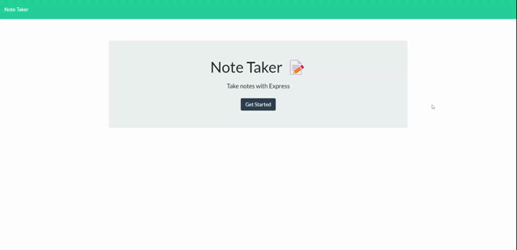
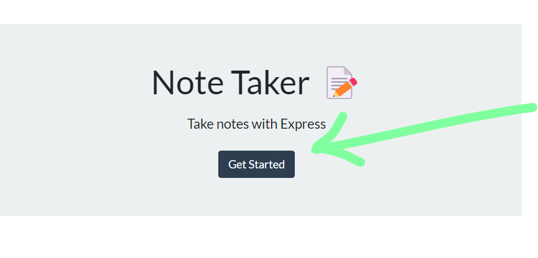
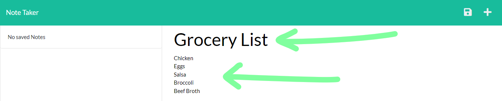
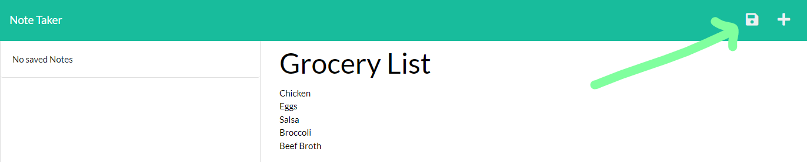
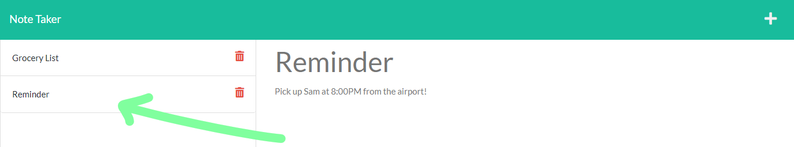
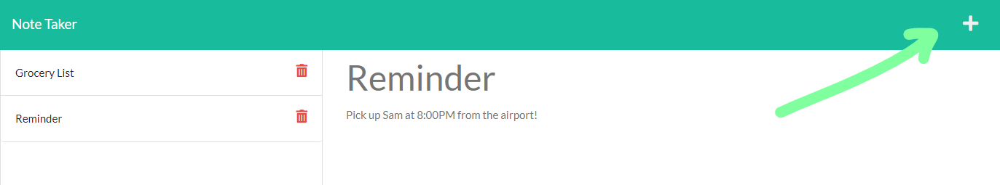
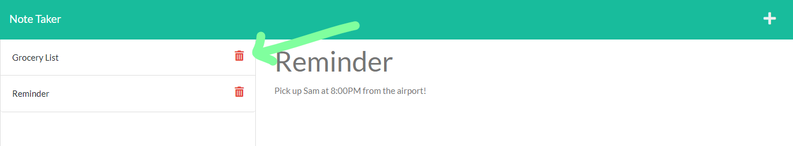

# NOTE TAKER
[](https://opensource.org/licenses/MIT)
[](code_of_conduct.md)

## Table of Contents
- [Description](#Description)
- [Links](##Links)
- [Technologies](##Technologies)
- [Screenshot of Application](#Screenshot-of-Application)
- [Installation Instructions](#Installation-Instructions)
- [User Instructions](#User-Instructions)
- [License](#License)
- [Contribution](#Contribution)
- [Acknowledgements](#Acknowledgements)
- [Questions](#Questions)

## Description
**Note Taker** is an application that allows for the user to write, save, and delete notes.  The intention of building this application is to provide the user a platform to keep track of tasks that need to be completed, reminders that need to be looked at later, and etcetera. 

## Technologies Used


## Links
- ### [URL to Deployed Application](https://inklein1997-note-taker.herokuapp.com/)
- ### [URL to Github Repository](https://github.com/inklein1997/Note-Taker)

## Screenshot of Webpage


## Installation Instructions
Since **Note Taker** is a NodeJS application, you must have NodeJS downloaded. Please download [here](https://nodejs.org/en/download/) if you have not done so.
<br><br>
The back-end of this application is powered by [Express](https://www.npmjs.com/package/inquirer). If you are working on this repo, please ensure that the Express package is installed by running the following command in your command-line...
```
$ npm install express
```

## User Instructions
1. Navigate to start page by **Clicking Get Started**<br>


2. Input note title AND note body.<br>


3. **Click the Save icon** in the top left corner.  __NOTE__ This icon will only appear if you have inputted BOTH the note title AND note body. <br>


4. If you would like to revisit a previously made note, **Click the note** on the left side of the page.<br>


5. To reset the note title and note body fields, **Click the '+' icon** in the top left corner.<br>


6. To delete a note, **Click the trash icon** next to the note you would like to remove.<br>


## License
This project is licensed under the terms of [MIT](https://opensource.org/licenses/MIT).
  
## Contribution
Before contributing to **Note Taker**, please read this [code of conduct](code_of_conduct.md)[^1].<br>
Here's how you can contribute...
1. Add issue or recommendation for improvement to Issues tab on Github.
2. Submit pull request for review.

## Acknowledgements
The front end of this application (specifically the ./public folder and its contents) was provided by the University of Texas at Austin Boot Camp curriculum.

## Questions
If you have any questions, please contact me via:
1. GitHub -- [@inklein1997](https://github.com/inklein1997)
2. Email -- michaelklein1997@gmail.com

[^1]: Code of Conduct provided by [Contributor Covenant](https://www.contributor-covenant.org/)